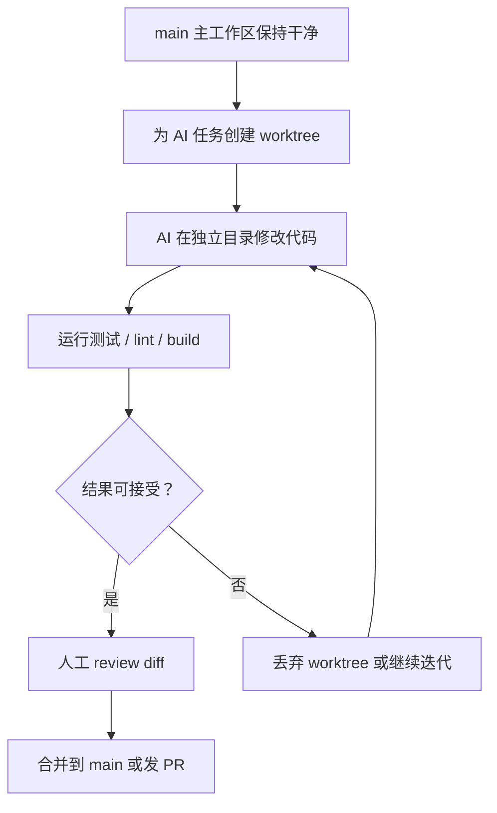

# GIT WORKTREE

视频教学：https://www.bilibili.com/video/BV1jRGb6GEsm?spm_id_from=333.788.player.switch&vd_source=15bae680e23049d4417233561746ed84&p=3

仓库地址：

## 1. 背景

最近随着智能体 AI Coding 的发展，`git worktree` 的功能越来越受到重视。它解决了一个非常现实的矛盾：

> [!IMPORTANT]
> AI 需要大胆改代码、并行试方案；人类又希望主工作区稳定、可控、不要被 AI 搞乱。

`git worktree` 可以让一个 Git 仓库同时拥有多个工作目录。每个工作目录都可以切到不同分支，互不污染，但它们共享同一个仓库的对象数据库和历史记录。

简单说：

> [!NOTE]
> `git worktree` = 给同一个仓库开多个“分身工作区”。

这特别适合下面这些场景：

| 场景 | 没有 worktree 时 | 使用 worktree 后 |
| --- | --- | --- |
| 同时开发多个需求 | 频繁 `stash` / `checkout`，容易混乱 | 每个需求一个目录 |
| 临时修线上 bug | 当前改动必须先保存或提交 | 新开 hotfix worktree 直接修 |
| AI Coding 并行探索 | AI 容易把主目录改乱 | 每个 AI 任务一个隔离目录 |
| 对比多个方案 | 分支切来切去 | 多个目录并排打开 |
| 跑不同版本服务 | 依赖、配置、端口互相影响 | 每个目录独立配置 |

## 2. 基础概念

### 2.1 普通 Git 工作方式

通常一个仓库只有一个工作目录：

```text
my-project/
├── .git/
├── src/
└── README.md
```

你在这个目录里切分支：

```bash
git switch feature-a
git switch main
git switch hotfix-login
```

问题是：同一时间只能看见一个分支的文件状态。如果当前分支有未提交修改，切分支还可能失败。

### 2.2 worktree 工作方式

使用 `git worktree` 后，一个仓库可以同时挂多个工作目录：

```text
project/
├── main/                 # 主工作区，通常保持干净
├── wt-feature-a/         # feature-a 分支
├── wt-hotfix-login/      # hotfix-login 分支
└── wt-ai-refactor/       # ai/refactor 分支
```

它们看起来是几个目录，但背后仍属于同一个 Git 仓库。

> [!TIP]
> worktree 不是复制完整仓库。它不会像 `git clone` 那样重新下载一份完整历史，所以创建速度通常很快，占用空间也更小。

## 3. 核心命令速查

| 命令 | 作用 |
| --- | --- |
| `git worktree list` | 查看所有 worktree |
| `git worktree add <path> <branch>` | 基于已有分支创建 worktree |
| `git worktree add -b <new-branch> <path> <start-point>` | 创建新分支并创建 worktree |
| `git worktree remove <path>` | 删除 worktree |
| `git worktree prune` | 清理已经失效的 worktree 记录 |
| `git worktree lock <path>` | 锁定 worktree，避免被误删 |
| `git worktree unlock <path>` | 解锁 worktree |
| `git worktree move <old-path> <new-path>` | 移动 worktree 目录 |

## 4. 可以直接跑通的实操 Demo

下面用一个临时仓库完整演示，建议直接复制执行。

> [!WARNING]
> 示例会创建 `/tmp/git-worktree-demo` 目录。如果你本机已有同名目录，请先换一个目录名。

### 4.1 初始化一个测试仓库

```bash
mkdir -p /tmp/git-worktree-demo
cd /tmp/git-worktree-demo

git init main-repo
cd main-repo

echo "# Git Worktree Demo" > README.md
git add README.md
git commit -m "init demo repo"
```

查看当前状态：

```bash
git status
git branch
```

预期看到：

```text
On branch main
nothing to commit, working tree clean
```

> [!NOTE]
> 如果你的 Git 默认分支叫 `master`，可以执行下面命令改成 `main`：
>
> ```bash
> git branch -M main
> ```

### 4.2 创建一个新分支 worktree

在仓库目录里执行：

```bash
git worktree add -b feature/login ../wt-feature-login main
```

含义：

| 参数 | 含义 |
| --- | --- |
| `-b feature/login` | 创建一个新分支 `feature/login` |
| `../wt-feature-login` | 新工作区目录 |
| `main` | 从 `main` 分支创建 |

查看 worktree：

```bash
git worktree list
```

可能输出：

```text
/tmp/git-worktree-demo/main-repo          <commit> [main]
/tmp/git-worktree-demo/wt-feature-login  <commit> [feature/login]
```

现在目录结构变成：

```text
/tmp/git-worktree-demo/
├── main-repo/          # main 分支
└── wt-feature-login/   # feature/login 分支
```

### 4.3 在新 worktree 中开发

进入新工作区：

```bash
cd ../wt-feature-login

mkdir -p src
echo "console.log('login feature');" > src/login.js

git status
git add src/login.js
git commit -m "add login feature"
```

此时回到主工作区：

```bash
cd ../main-repo
ls src
```

你会发现主工作区没有 `src/login.js`。

> [!IMPORTANT]
> 这就是 worktree 的价值：`feature/login` 的改动在自己的目录里，`main` 目录保持干净。

### 4.4 合并 worktree 分支

在主工作区执行：

```bash
cd /tmp/git-worktree-demo/main-repo
git switch main
git merge feature/login
```

合并后查看：

```bash
ls src
git log --oneline --decorate --graph --all
```

### 4.5 删除 worktree

当 `feature/login` 已经合并，不再需要这个工作目录：

```bash
cd /tmp/git-worktree-demo/main-repo
git worktree remove ../wt-feature-login
```

如果确认分支也不需要了：

```bash
git branch -d feature/login
```

最后清理失效记录：

```bash
git worktree prune
```

## 5. 常用操作详解

### 5.1 基于新分支创建 worktree

最常用：

```bash
git worktree add -b feature/user-profile ../wt-user-profile main
```

适合开发一个新需求。

### 5.2 基于已有分支创建 worktree

如果分支已经存在：

```bash
git worktree add ../wt-user-profile feature/user-profile
```

> [!WARNING]
> 同一个分支默认不能同时被两个 worktree checkout。
>
> 例如 `main` 已经在主目录中使用，再执行下面命令通常会失败：
>
> ```bash
> git worktree add ../wt-main main
> ```
>
> Git 这样设计是为了避免两个目录同时修改同一分支，造成分支指针混乱。

### 5.3 基于远程分支创建 worktree

先拉取远程分支信息：

```bash
git fetch origin
```

创建本地分支并生成 worktree：

```bash
git worktree add -b feature/payment ../wt-payment origin/feature/payment
```

或者如果本地已有追踪分支：

```bash
git worktree add ../wt-payment feature/payment
```

### 5.4 临时修复线上 bug

假设你正在开发 `feature/search`，但突然要修复线上问题。

不要急着 `stash`，可以直接开一个 hotfix worktree：

```bash
git worktree add -b hotfix/login-crash ../wt-hotfix-login-crash main
cd ../wt-hotfix-login-crash
```

修复、提交：

```bash
git add .
git commit -m "fix login crash"
```

合并回主分支：

```bash
cd ../main-repo
git merge hotfix/login-crash
```

清理：

```bash
git worktree remove ../wt-hotfix-login-crash
git branch -d hotfix/login-crash
```

### 5.5 删除失败怎么办

如果 worktree 里还有未提交修改，执行：

```bash
git worktree remove ../wt-feature-a
```

可能会失败。先进入 worktree 查看：

```bash
cd ../wt-feature-a
git status
```

如果修改还要保留：

```bash
git add .
git commit -m "save feature a progress"
```

如果确认不要这些修改，再强制删除：

```bash
git worktree remove --force ../wt-feature-a
```

> [!CAUTION]
> `--force` 会丢弃该 worktree 中未提交的内容。执行前一定要确认 `git status`。

## 6. 推荐目录命名

### 6.1 简单项目

```text
my-project/
├── repo/                 # 主工作区
├── wt-feature-login/
├── wt-feature-payment/
└── wt-hotfix-20260624/
```

### 6.2 多 AI 任务

```text
my-project/
├── repo/
├── ai-001-refactor-auth/
├── ai-002-fix-test/
├── ai-003-new-dashboard/
└── ai-004-upgrade-deps/
```

### 6.3 推荐命名规则

```text
wt-<类型>-<任务名>
ai-<编号>-<任务名>
```

示例：

```bash
git worktree add -b ai/refactor-auth ../ai-001-refactor-auth main
git worktree add -b ai/fix-user-test ../ai-002-fix-user-test main
git worktree add -b hotfix/order-timeout ../wt-hotfix-order-timeout main
```

> [!TIP]
> 分支名和目录名不必完全一样，但建议能互相对应。人脑也是有限缓存，别给它制造谜题。

## 7. Git Worktree 在 AI Coding 中的重点应用

### 7.1 为什么 AI Coding 特别适合 worktree

AI Coding 常见特点：

1. AI 会一次性改很多文件。
2. AI 可能会尝试多个方案。
3. AI 有时会误改无关文件。
4. 人类需要审查、对比、回滚。
5. 多个智能体可能同时处理不同任务。

如果所有操作都发生在主工作区，风险很高：

```text
main 工作区
├── 人类正在写的代码
├── AI 方案 A
├── AI 方案 B
├── 临时 debug
└── 未提交实验代码
```

这会很快变成“谁改了什么我是谁我在哪”的状态。

使用 worktree 后：

```text
repo-main/               # 人类稳定主工作区
ai-plan-a/               # AI 方案 A
ai-plan-b/               # AI 方案 B
ai-test-fix/             # AI 专门修测试
ai-docs-update/          # AI 专门写文档
```

每个任务都有自己的分支和目录，互不影响。

### 7.2 AI Coding 推荐工作流



### 7.3 给 AI 分配一个独立任务

假设要让 AI 重构认证模块：

```bash
git worktree add -b ai/refactor-auth ../ai-refactor-auth main
cd ../ai-refactor-auth
```

然后让 AI 只在这个目录里工作。

建议给 AI 的提示词可以这样写：

```text
你现在只允许修改当前 worktree 目录中的文件。
任务：重构认证模块，提高可读性并保持现有行为不变。
要求：
1. 不要修改无关模块。
2. 修改后运行测试。
3. 最后总结改动文件、验证命令和风险点。
```

> [!IMPORTANT]
> 让 AI 在独立 worktree 里工作，可以把“探索性修改”和“稳定主线”隔离开。

### 7.4 多个 AI 方案并行对比

同一个需求可以让 AI 试两个方向：

```bash
git worktree add -b ai/search-sql ../ai-search-sql main
git worktree add -b ai/search-cache ../ai-search-cache main
```

方案 A：直接优化 SQL。

```bash
cd ../ai-search-sql
```

方案 B：引入缓存层。

```bash
cd ../ai-search-cache
```

对比两个方案：

```bash
git diff main..ai/search-sql
git diff main..ai/search-cache
```

也可以看文件统计：

```bash
git diff --stat main..ai/search-sql
git diff --stat main..ai/search-cache
```

> [!TIP]
> AI Coding 不一定一次就要得到“唯一正确答案”。worktree 让多个方案并排存在，方便用测试结果和 diff 质量来做判断。

### 7.5 一个智能体一个 worktree

如果你同时使用多个 AI Agent，建议：

| Agent | worktree | 任务 |
| --- | --- | --- |
| Agent A | `../ai-api-refactor` | 重构 API 层 |
| Agent B | `../ai-test-fix` | 补测试、修失败用例 |
| Agent C | `../ai-ui-polish` | 优化前端交互 |
| Agent D | `../ai-docs` | 更新文档 |

创建命令：

```bash
git worktree add -b ai/api-refactor ../ai-api-refactor main
git worktree add -b ai/test-fix ../ai-test-fix main
git worktree add -b ai/ui-polish ../ai-ui-polish main
git worktree add -b ai/docs ../ai-docs main
```

每个 Agent 完成后：

```bash
cd ../ai-api-refactor
git status
git diff
git log --oneline main..HEAD
```

审查没问题再合并：

```bash
cd ../repo-main
git merge ai/api-refactor
```

### 7.6 AI Coding 的检查清单

在合并 AI worktree 前，建议逐项检查：

- [ ] `git status` 是干净的，或者未提交修改都已经确认。
- [ ] `git diff main..分支名` 中没有无关文件。
- [ ] 测试已经跑过。
- [ ] 构建已经跑过。
- [ ] 重要配置文件没有被误改。
- [ ] 依赖文件如 `package-lock.json`、`pnpm-lock.yaml`、`go.sum` 的变化是合理的。
- [ ] AI 总结的改动和实际 diff 一致。

常用检查命令：

```bash
git status
git diff --stat main..HEAD
git diff main..HEAD
git log --oneline --decorate main..HEAD
```

## 8. 实战模板

### 8.1 新需求开发模板

```bash
# 1. 在主工作区保持最新
git switch main
git pull

# 2. 创建新 worktree
git worktree add -b feature/order-export ../wt-order-export main

# 3. 进入新目录开发
cd ../wt-order-export

# 4. 开发、提交
git add .
git commit -m "add order export"

# 5. 回主工作区合并
cd ../main-repo
git merge feature/order-export

# 6. 清理 worktree
git worktree remove ../wt-order-export
git branch -d feature/order-export
```

### 8.2 AI 任务模板

```bash
# 1. 从 main 创建 AI 专用分支和工作区
git worktree add -b ai/fix-login-test ../ai-fix-login-test main

# 2. 进入 AI 工作区
cd ../ai-fix-login-test

# 3. 让 AI 在当前目录执行任务
# 4. 运行测试
npm test

# 5. 查看 AI 改了什么
git status
git diff --stat main..HEAD
git diff main..HEAD

# 6. 提交
git add .
git commit -m "fix login tests"
```

### 8.3 临时 review 某个 PR 分支

```bash
git fetch origin
git worktree add ../review-pr-123 origin/feature/some-pr
cd ../review-pr-123
```

如果需要在本地提交修改，建议新建本地分支：

```bash
git switch -c review/pr-123-fix
```

## 9. 常见坑

### 9.1 同一个分支不能被多个 worktree 同时使用

错误示例：

```bash
git worktree add ../another-main main
```

如果 `main` 已经在主目录中，通常会报错：

```text
'main' is already checked out
```

解决方式：为新 worktree 创建独立分支。

```bash
git worktree add -b temp/main-copy ../another-main main
```

### 9.2 worktree 删除目录后，Git 记录还在

如果你手动删除了 worktree 目录：

```bash
rm -rf ../wt-old-feature
```

`git worktree list` 可能还会看到旧记录。清理：

```bash
git worktree prune
```

> [!TIP]
> 更推荐用 `git worktree remove <path>` 删除，而不是直接手动删目录。

### 9.3 每个 worktree 都要单独安装依赖吗

通常是的。

例如 Node 项目：

```bash
cd ../wt-feature-a
npm install
```

因为每个 worktree 是独立目录，`node_modules` 不会自动共享。

可选优化：

| 技术栈 | 优化方式 |
| --- | --- |
| Node + pnpm | 使用 pnpm 全局 store，多个 worktree 安装会快很多 |
| Go | Go module cache 默认可复用 |
| Rust | Cargo cache 默认可复用，`target` 可按项目情况共享 |
| Python | 每个 worktree 使用独立虚拟环境 |

### 9.4 环境变量和端口冲突

多个 worktree 同时跑服务时，容易端口冲突。

建议每个 worktree 有自己的 `.env.local`：

```text
repo-main/.env.local              PORT=3000
ai-refactor-auth/.env.local       PORT=3001
ai-fix-tests/.env.local           PORT=3002
```

> [!IMPORTANT]
> 多个 AI worktree 同时跑服务时，要重点检查端口、数据库、缓存、消息队列等共享资源，避免互相影响。

### 9.5 IDE 会打开多个相似项目

建议在 IDE 窗口标题、终端提示符或目录名中明显标识任务：

```text
ai-001-refactor-auth
ai-002-fix-payment-test
wt-hotfix-login-crash
```

减少在错误目录提交代码的概率。

## 10. 和其他方案的区别

| 方案 | 特点 | 适合场景 |
| --- | --- | --- |
| `git switch` | 一个目录切多个分支 | 简单切换 |
| `git stash` | 暂存当前未提交修改 | 临时打断 |
| `git clone` | 完整复制仓库 | 完全隔离、长期独立 |
| `git worktree` | 一个仓库多个工作目录 | 并行开发、AI Coding、多方案对比 |

> [!NOTE]
> `git worktree` 不是替代分支，而是让分支可以同时出现在多个目录中。

## 11. 推荐最佳实践

1. 主工作区只做稳定操作，尽量保持干净。
2. 每个任务一个 worktree，每个 worktree 一个分支。
3. AI 任务统一使用 `ai/...` 分支前缀。
4. hotfix 使用 `hotfix/...` 分支前缀。
5. 合并前必须看 `git diff --stat` 和关键 diff。
6. 合并后及时删除无用 worktree。
7. 不要让多个 worktree 共享同一个运行端口。
8. 不要在不确认状态的情况下使用 `--force`。
9. 长期保留的重要 worktree 可以加锁：

```bash
git worktree lock ../important-worktree
```

解锁：

```bash
git worktree unlock ../important-worktree
```

## 12. 一套个人常用命令

### 创建 AI 任务

```bash
git worktree add -b ai/<task-name> ../ai-<task-name> main
cd ../ai-<task-name>
```

### 查看所有 worktree

```bash
git worktree list
```

### 查看当前 worktree 改动

```bash
git status
git diff
git diff --stat main..HEAD
```

### 合并 AI 结果

```bash
cd ../repo-main
git switch main
git merge ai/<task-name>
```

### 清理 AI worktree

```bash
git worktree remove ../ai-<task-name>
git branch -d ai/<task-name>
git worktree prune
```

## 13. 总结

`git worktree` 的核心价值不是“多一个 Git 命令”，而是改变工作方式：

> [!IMPORTANT]
> 把不同任务、不同分支、不同 AI 实验隔离到不同目录里，让主工作区稳定，让探索更大胆。

尤其在 AI Coding 时代，推荐形成一个习惯：

```text
主工作区负责稳定
worktree 负责探索
分支负责记录
diff 负责审查
测试负责兜底
```

当 AI 要大改代码时，不要直接在主目录开干。先开一个 worktree：

```bash
git worktree add -b ai/safe-experiment ../ai-safe-experiment main
```

然后放心探索，最后用 Git 的 diff、test、review 来决定是否合并。

